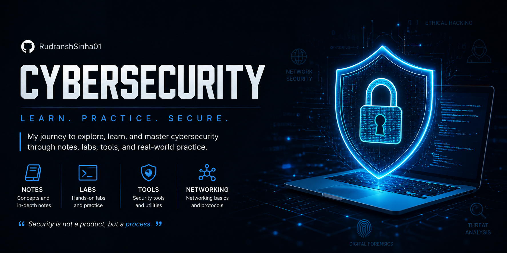

  

<h1 align="center">🛡️ Cybersecurity Notes</h1>

  
  
  

A structured collection of my cybersecurity learning journey, including concepts, hands-on labs, Cisco networking exercises, and practical notes.

## About This Repository

This repository serves as my personal knowledge base and portfolio as I build a career in cybersecurity. The notes are created while studying, practicing labs, and completing networking and security exercises.

## Topics Covered

- Networking Fundamentals
- Cisco Packet Tracer Labs
- TryHackMe Labs Writeups
- 

## Learning Goals

- Build strong networking fundamentals
- Develop practical cybersecurity skills
- Document every important concept
- Complete hands-on labs regularly
- Create a public portfolio of technical knowledge

## Current Status

- Cisco Networking Academy
- Daily cybersecurity notes
- Packet Tracer practice
- Continuous GitHub updates

## Tech & Tools

- Cisco Packet Tracer
- Git & GitHub
- Markdown
- Linux
- Python

## Connect

If you're also learning cybersecurity, feel free to explore the notes, suggest improvements, or connect.

---

**Learning in public. Building skills one day at a time.**
